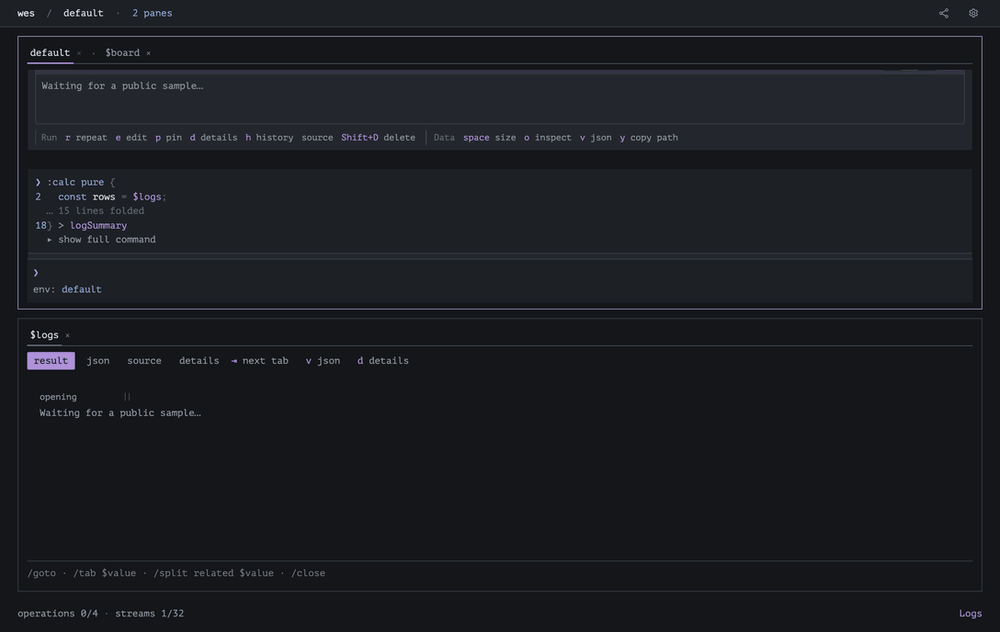
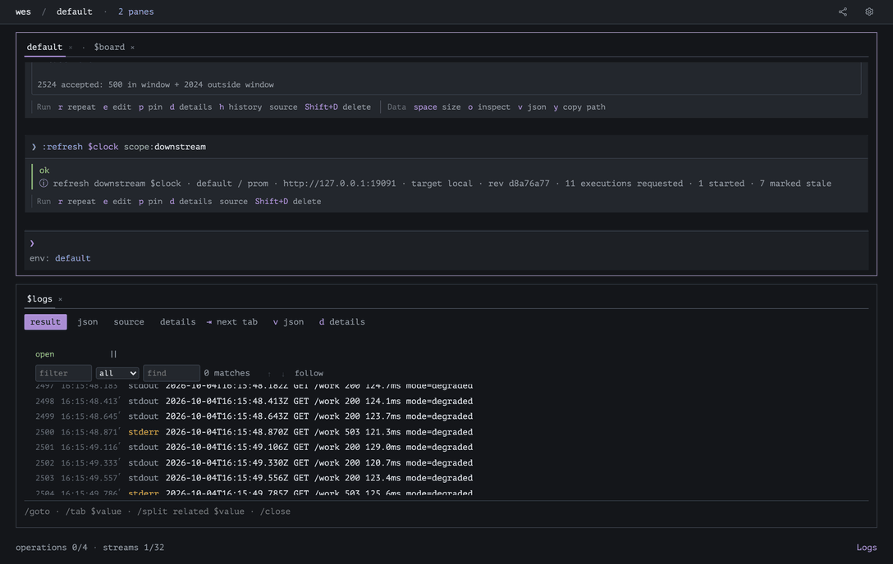

# 14. A Prometheus dashboard

Query a real Prometheus HTTP API, adapt its responses to typed Timeline values,
and explore them on a shared time axis. Follow committed results, retain an
incident input, and monitor live container resources and logs in the same UI.

## Prerequisites

- [Values and field access](../02-values-and-operators/README.md),
  [time values](../05-time-values/README.md), and
  [dependencies and refresh](../06-nodes-and-dependencies/README.md).
- [API contracts](../12-api-contracts/README.md) and a Wes checkout with its
  OpenAPI extractor built. Run all commands from this tutorial repository.
- Docker with Compose and a local Unix Docker socket. The checked programs use
  loopback ports 18770 and 19091; no credentials or remote services are needed.
- Python 3.11+, Node.js 22+, Go 1.26+, the Rust toolchain in the Wes checkout,
  the Wes npm workspace dependencies, and the GUI.
  Build the CLI and native view validator in the Wes checkout:

  ```sh
  cd ../wes
  npm ci
  cargo build -p wes -p wes-views --bin wes --bin wes-view-build --locked
  (cd tools/describe && go build -o wes-extract ./cmd/extract)
  npm run build --workspace wes-gui
  cd ../wes-tutorial
  ```

## See it first

Run the prepared interactive demo:

```sh
python3 14-prom/preview.py
```

Docker must be running. The first setup may take longer while images are pulled
and built. If Docker uses a different local Unix socket, pass its absolute path
with `--socket` or set `WES_DOCKER_SOCKET`; the launcher does not change Docker
contexts. `WES_VIEW_CONTRACT_TOOL` can select the matching `wes-view-build` binary.

Open the printed loopback URL. The launcher also prints the path of a
`dashboard.json` file containing this workspace's result references and layout.
Open that file and copy its contents. In the Wes session, enter `/dashboard`,
click **Import definition**, paste the contents into **Dashboard definition**,
click **Load draft**, then **Save**. Click **Back to session**, then enter
`/tabx $orders` to open and focus the saved layout: grouped timelines and
container resources above live logs.

The original **default** tab contains the command session. **Back to session**
leaves the dashboard library or editor. **Close dashboard** closes a dashboard
view tab without removing its saved layout. Return to **default** to run Wes
commands, or enter `/split right` from the dashboard to keep a session beside
it. `/tab` opens a background tab; `/tabx` also focuses it. On macOS, ⌘⇧F
expands the focused pane; Escape restores the split. A small pane scrolls its
presentation instead of shrinking the text or dropping chart data. Dashboard
definitions contain no values or credentials and belong to the session that
produced their references; do not reuse this file with another preview.

The demo uses a temporary data home. Ctrl+C stops its Wes server and removes
that temporary workspace. A newly created lab is stopped. Existing lab containers
are reused and may be started if stopped; they are left running and the original
service profile is restored. It never uses an installed
application's data home. Select another checkout with `WES_CHECKOUT`, another
binary with `--binary`, GUI with `--site`, or socket with `--socket`.




The recordings use the actual client, synthetic lab traffic and the programs
below. Metrics change when their queries are refreshed. Resources and logs
keep receiving new samples and show the most recent ones. Opening the dashboard
shows the data already fetched; it does not send another query or start a stream.

## The lab

`14-prom/lab/` owns Compose project `wes-tutorial-14`:

| Service | Role | Loopback address |
| --- | --- | --- |
| orders-api | synthetic service; counts and times GET /work | 127.0.0.1:18770 |
| workload | makes real requests, with a 0.1 s pause between them | none |
| prometheus | real Prometheus; scrapes orders-api every second | 127.0.0.1:19091 |

The healthy profile answers after about 10 ms. The degraded profile takes about
120 ms and answers every fourth request with HTTP 503. These timings and status
codes are built into the lab service. The dashboard shows the measured values;
it does not decide whether the service is healthy.
Actual 200 lines go to stdout; 503 lines and profile changes go to stderr.

```sh
sh 14-prom/lab/setup.sh
```

Setup verifies the Compose project's owner, waits for healthy services and enough
samples to calculate a rate. Only this chapter's services are managed. The first
run downloads the lab images. The programs use the default ports; if
`WES14_ORDERS_API_PORT` or `WES14_PROMETHEUS_PORT` changes them, also update the
matching contracts and configuration. The automated check requires the defaults.

## 1. Prepare and import the API contracts

The supplied OpenAPI documents describe the lab's actual endpoints. Describe
converts them to executable contract files without invoking the API:

```wes
:describe file:"14-prom/prom.yaml" provider:prom out:"14-prom/lab/.state/p.json"
:describe file:"14-prom/api.yaml" provider:demo out:"14-prom/lab/.state/a.json"
```

Define configuration as data:

```wes
:calc pure {
  return {
    prom: {
      file: "14-prom/lab/.state/p.json",
      url: "http://127.0.0.1:19091",
    },
    demo: {
      file: "14-prom/lab/.state/a.json",
      url: "http://127.0.0.1:18770",
    },
  };
} > cfg
```

Plan each import and apply its result as a **separate submission**:

```wes
:import plan spec file:$cfg.prom.file endpoint:$cfg.prom.url > promPlan
:import apply $promPlan
:import plan spec file:$cfg.demo.file endpoint:$cfg.demo.url > demoPlan
:import apply $demoPlan
```

`file:$cfg.prom.file` selects a scalar field from an existing result. A plan
captures those arguments and their origins, not the file's contents. Apply reads
and validates the contract and installs the provider under the same authority.
Planning does not grant access or execute an operation. If the captured input or
context changes, make a new plan. Do not transfer a plan between clients.

## 2. Define one reusable adapter and load a view

Run the definitions in [helpers.wes](helpers.wes) as separate submissions. It
loads [types.yaml](types.yaml) and defines:

| Template | Input and result | Purpose |
| --- | --- | --- |
| PromRange | query + Interval → HttpResponse | call Prometheus query_range |
| Draw | response body + Interval + plot metadata → Timeline | validate and adapt samples |
| Latest | Timeline + plot metadata → Metric | optional finite-data reuse |

`PromRange` performs a SAFE external read. `Draw` and `Latest` are pure:
they transform supplied values and make no API calls. SAFE does not mean that
Wes polls automatically.

Discover adapters and inspect Draw:

```wes
:list adapters > adapters
:inspect template:Draw > adapterInfo
```

The charts use the shipped Timeline and TimelineGroup views. The container
resource card uses an independent React package in
[container-resources/](container-resources/). Build it before loading:

```sh
export WES_VIEW_CONTRACT_TOOL="../wes/target/debug/wes-view-build"
node ../wes/tools/view-package/index.mjs build \
  14-prom/container-resources \
  14-prom/lab/.state/container-resources.wes-view.json
```

```wes
:package load path:"14-prom/lab/.state/container-resources.wes-view.json"
```

ContainerResources receives one adapted Docker stats record. It contains no
API client, timer or service-health rule. The preview launcher builds a scratch
copy automatically. The original [PrometheusPanel](prometheus-panel/) package
is an optional example of a standalone reading-and-trend view; it is not a
member of this grouped dashboard.

## 3. Select the expressions and a shared interval

```wes
:calc pure {
  return {
    rate: {
      query: "sum(rate(wes_demo_requests_total[10s]))",
      plot: {id: "rate", title: "Request rate", unit: "req/s"},
    },
    errors: {
      query: "100 * sum(rate(wes_demo_requests_total{status=\"503\"}[10s]))"
        + " / clamp_min(sum(rate(wes_demo_requests_total[10s])), 0.001)",
      plot: {id: "errors", title: "HTTP 503 share", unit: "%"},
    },
    latency: {
      query: "1000 * histogram_quantile(0.95, sum by (le) ("
        + "rate(wes_demo_request_duration_seconds_bucket[10s])))",
      plot: {id: "latency", title: "p95 latency", unit: "ms"},
    },
  };
} > queries
```

The error expression counts **HTTP 503 share**, not all error statuses. The
latency expression estimates p95 from histogram buckets; it is not a raw request
measurement. Units are explicit plot metadata.

```wes
prom query query:"vector(time())" > clock
:calc {
  const end = fromEpochSeconds(
    decimal($clock.body.data.result[0].value[1])
  );
  return interval(end - duration("PT1M"), end);
} > window
```

The clock comes from Prometheus through `vector(time())`. All three queries
use the same preceding one-minute interval. This is a finite interval, not a
moving live window. Refreshing the clock advances it.

## 4. Fetch, adapt and create the panels

```wes
PromRange query:$queries.rate.query window:$window > rateRaw
PromRange query:$queries.errors.query window:$window > errorsRaw
PromRange query:$queries.latency.query window:$window > p95Raw
```

Each raw result is a typed HttpResponse with status, headers, body and contract
validation. Run each pipeline below as a separate submission:

```wes
$rateRaw
  | Draw input:input.body span:$window p:$queries.rate.plot > rateData
  | :view create Timeline > ratePanel
$errorsRaw
  | Draw input:input.body span:$window p:$queries.errors.plot > errorsData
  | :view create Timeline > errorsPanel
$p95Raw
  | Draw input:input.body span:$window p:$queries.latency.plot > latencyData
  | :view create Timeline > latencyPanel
```

`input` is the previous pipeline value. `input.body` projects the HTTP body into
Draw. `> rateData` names the intermediate Timeline, so its data remains available
for inspection and reuse. `:view create` is a terminal presentation step: it
creates the panel once. Updating the input does not create another panel.
Naming a result does not, by itself, promise permanent retention.

Draw rejects non-success API bodies, a non-matrix result, multiple series and
malformed sample pairs. An absent series becomes an empty Timeline. Prometheus's
inclusive range end is filtered to Wes's half-open `[start, end)` interval.
A NaN sample becomes an explicit gap; its placeholder numeric field is never
plotted as a zero. Infinity is rejected by the decimal conversion.

Each Timeline shows its supplied samples, units and exact timestamps. Inspect
opens its data details. The time axis comes from the supplied interval; the
vertical axes use actual plotted bounds and retain independent units. A missing
or all-gap series is not a zero-valued metric.

## 5. Assemble the dashboard

```wes
:calc pure {
  return {
    view: "timeline-group",
    title: "Orders API · Prometheus",
    range: $window,
  };
} > groupData
:view create TimelineGroup input:$groupData > board
:view connect $ratePanel to:$board
:view connect $errorsPanel to:$board
:view connect $latencyPanel to:$board
:inspect $board > boardInfo
```

The TimelineGroup has three members: request rate, HTTP 503 share and p95
latency. Its time cursor, viewport and selection coordinate the members while
their vertical axes remain independent. `boardInfo` exposes member identities
and the configuration revision.

`groupData` and the three child inputs follow Current results. Opening a view
reads committed data; it does not execute its sources. After refreshing the
query interval, **Fit** changes the viewport to the new interval. Refreshing
input alone preserves navigation, including an existing zoom or selection.

## 6. Follow a changed service with one refresh

```wes
demo setProfile body:{mode:"degraded"} > degraded
```

The structured body is a direct record argument; no helper body result is needed.
This operation changes the synthetic service and is UNSAFE. Submit it explicitly.
Wait several scrapes so the changed behavior enters the ten-second rate window,
then run:

```wes
:refresh $clock scope:downstream
```

This explicitly refreshes the clock and its downstream network queries. Default
Automatic policy updates the pure window calculation and Draw adapters from the
new committed inputs. Current panels read those results without a bind command.
Their identities and the dashboard's three memberships remain unchanged.

The displayed time and interval identify the fetched data. An open panel is
not proof that its HTTP source is currently executing or polling.

Restore the service and refresh after several scrapes:

```wes
demo setProfile body:{mode:"healthy"} > recovered
```
```wes
:refresh $clock scope:downstream
```

## 7. Retain an incident, then resume following



```wes
:view pin $errorsPanel > incident
```

Pin stores the exact displayed Timeline input under `incident` and binds the
panel to that retained result. It does not retain the entire HttpResponse or
freeze all dashboard members. Refresh again: other panels follow updated data,
while errorsPanel keeps the retained interval and samples. Open `$incident` to
inspect the saved input independently.

```wes
:view bind $errorsPanel input:$errorsData
```

The panel now shows the latest `$errorsData` again and follows later updates.
This uses the existing result; it does not query Prometheus or rerun Draw.
The retained `$incident` remains available separately.

## 8. Monitor actual logs and container resources


This excerpt is captured from the desktop client. New log events arrive while
following the newest lines and while reading older ones. The accepted count
keeps increasing in both cases.


```wes
:import docker socket:"/var/run/docker.sock" as:labDocker
labDocker containers project:"wes-tutorial-14" > containers
:calc {
  const rows = $containers.rows.filter(row => {
    return row.service == some("orders-api");
  });
  check("SingleSeries", length(rows));
  return rows[0].id;
} > containerId
labDocker logs follow container:$containerId tail:20 > logs
```

Replace the socket literal if Docker uses another Unix socket. `containers`
selects this lab's project; the calculation requires exactly one orders-api
container and uses its full ID. `logs follow` creates the live source.

Enter `/tab $board` and `/split down $logs`, then select the $board tab.
The log view supports find/filter and stdout/stderr selection. **follow** keeps
the newest event visible. **reading** keeps the current reading position while
new events arrive. Scrolling away from the tail enters reading mode; **follow**
returns to the newest event. Neither display mode cancels the Docker source.
The retained window is bounded to 500 events or 8 MiB, whichever is reached
first. It is not a complete recording of the container's lifetime.

A local pure summary reads the latest twenty events:

```wes
:calc pure {
  const rows = $logs;
  if (length(rows) == 0) {
    return {analyzed: 0, errors: 0, last: 0};
  }
  let start = length(rows) - 20;
  if (start < 0) {
    start = 0;
  }
  const recent = iter.items(rows).skip(start).collect();
  return {
    analyzed: length(recent),
    errors: length(recent.filter(row => {
      return iter.matches(row.text, "GET /work 503 ").count() > 0;
    })),
    last: rows[length(rows) - 1].sequence,
  };
} > logSummary
```

Automatic pure updates require no workspace-wide policy command. Log arrivals
update this summary without refreshing the independent finite Prometheus clock.
The summary counts literal `GET /work 503 ` lines, not every possible error.

Start the Docker stats stream for the same exact container:

```wes
labDocker stats container:$containerId > stats
```

Run [resource-data.wes](resource-data.wes). Its pure calculation selects the
latest delivered sample and copies CPU and memory fields into the resource
view input. It converts epoch nanoseconds to Instant without passing through a
floating-point clock. Missing values and their source reasons stay optional.
The renderer receives one small record, not the complete stats window.

CPU **100% means one core**; it can exceed 100%. The dial scale uses the online
CPU count Docker reports, which is not a container CPU quota. Memory working
set is usage minus the reported cache counter. The memory limit may be the
Docker daemon's available memory when no container limit is configured. Unknown
values are labelled with their reasons rather than shown as zero. The card
shows Docker's sample time, Wes's receive time and the stream sequence.

Open `/dashboard` and create a UI dashboard named `orders`. Add `$board`,
`$resourcePanel` and `$logs` from existing results. Put the first two in a row,
set their weights to 2 and 1, then keep logs below that row. Save and open
`/tabx $orders`. This is a UI layout; it starts no operations. Its stored
references stay with this workspace session. At narrow widths the row stacks.
The live cards reserve their height as new samples arrive.

```wes
:cancel $logs
:cancel $stats
```

Cancellation stops both capture sources and their dependent computations; it does not
stop the container, workload, or Prometheus. The last stopped window remains
readable. Resuming capture requires an explicit source refresh.

## Watch out

- HTTP status is data. [bad-query.wes](bad-query.wes) produces HTTP 400 with
  `errorType: "bad_data"` and a PromQL parse error. A successful HTTP transport
  does not imply a successful Prometheus expression.
- [empty.wes](empty.wes) produces HTTP 200 and an empty series list. Missing
  series are not a zero-valued metric. Latest rejects an empty or all-gap input.
- The chapter's Draw handles only zero or one series. Add label/ID mapping to
  that adapter before querying multiple series; the view alone cannot repair
  an invalid data contract.
- Draw sets `coverage` to the requested interval and `omitted` to zero. These
  fields do not prove that every scrape arrived. The adapter does not check for
  missing scrapes or decide whether the service meets an SLO.
- Timeline accepts at most eight series and 20,000 samples or events. Larger
  inputs are refused with an explanation. The resource card's sizes are listed
  in [container-resources/view.json](container-resources/view.json). If the pane
  is too small, scroll to see the content; the text is not shrunk to fit. Inspect
  the data to read full numeric values.
- **Stop observing** stops a view from reading newer results. **Hold** freezes
  its display. **Pin** saves the displayed input and keeps showing it.
  **Cancel** stops the source operation.
- The check uses `--no-auto-keep`, so results are not automatically saved for a
  restart. Pin saves its selected input explicitly. Reopening the workspace
  does not send an HTTP request again, even for a pinned view.

## Run the programs

```sh
python3 14-prom/check.py
```

The check uses an isolated temporary workspace, actual lab Prometheus responses
and container stdout/stderr. It verifies sample conversion, HTTP 400 and empty
responses, healthy/degraded/recovered behavior, unchanged panel constructors,
Current following without rebind, read-only panel reopen, exact Pin/Follow,
exact Docker resource adaptation, stable stream-view identity, a 500-event
log window and cancellation. It restores an existing lab's profile and stops only a lab it
started. Docker unavailable is reported as SKIP, not a passed infrastructure test.

```sh
sh 14-prom/lab/teardown.sh
```

Stop the owned lab after manual use. Neither script operates other Compose
projects.

## Syntax summary

| Syntax | Behavior |
| --- | --- |
| :import plan spec … > plan | capture arguments without reading contents |
| :import apply $plan | validate and install the captured contract |
| body:{mode:"degraded"} | structured operation argument |
| :list adapters | discover input-consuming templates |
| value \| Draw input:input.body … > data | project and name an adapted result |
| … \| :view create Timeline > panel | create one presentation |
| :refresh $clock scope:downstream | explicitly fetch a new shared interval |
| :view pin $errorsPanel > incident | retain and show the exact input |
| :view bind $errorsPanel input:$errorsData | resume Current reading |
| :cancel $logs | stop the source, leaving the service running |

## Exercises

1. Retain errorsPanel during degraded behavior. Recover and refresh. Which
   panels change, and which interval stays fixed?

   <details><summary>Answer</summary>

   Run pin.wes before recover.wes and refresh.wes. errorsPanel keeps the retained
   degraded Timeline; request rate and latency follow the refreshed inputs.
   follow.wes reconnects errorsPanel to Current errorsData.

   </details>

2. Stop log display movement without stopping capture. Then cancel the source.
   Which action affects the finite Prometheus queries?

   <details><summary>Answer</summary>

   Reading mode affects only the visible log. Cancel stops the Docker log source. Neither
   action refreshes the independent finite clock; refresh.wes does so explicitly.

   </details>

Continue with [custom views](../custom-views/README.md) to develop and review
independent React presentations for other typed results.
